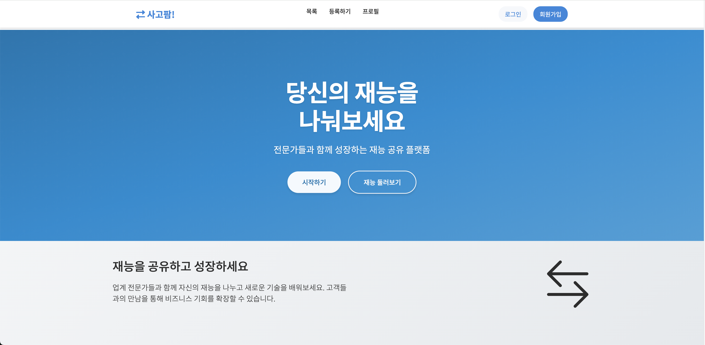
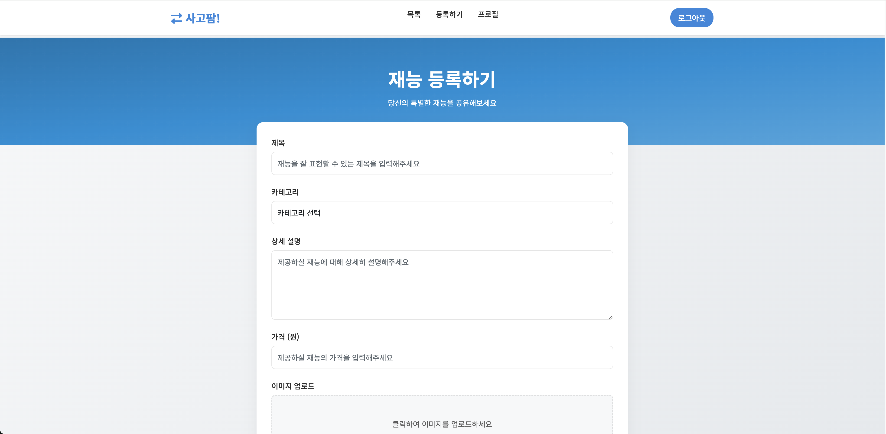
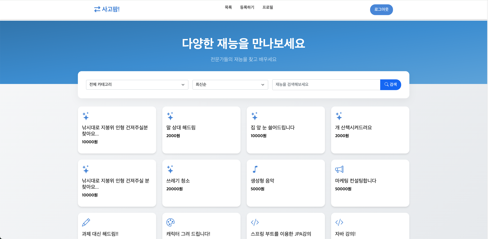
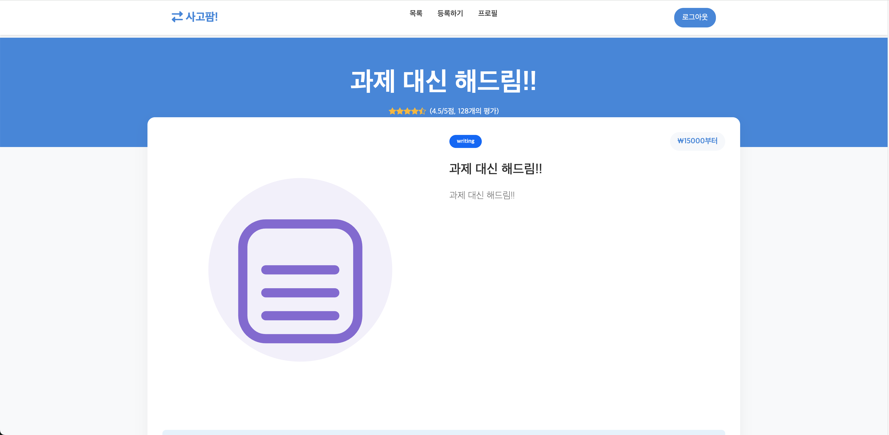
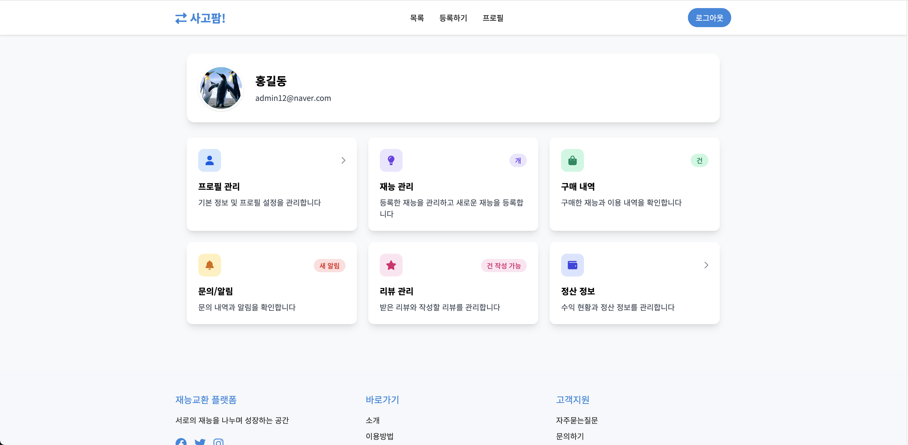

# JSP 웹 프로젝트

이 프로젝트는 JSP와 Java 백엔드 기술을 사용하여 거래, 재능, 리뷰, 문의, 계정을 관리할 수 있는 플랫폼을 구현합니다. 아래는 구성 요소와 기능에 대한 상세한 설명입니다.

---

## 주요 기능

### 1. 재능 관리
- 사용자는 자신의 재능을 등록, 업데이트 및 삭제할 수 있습니다.
- 재능에는 `title`, `description`, `price`, `category`, `image` 등 필드가 포함됩니다.
- 재능은 특정 사용자(`memberId`)와 연관됩니다.
- `title` 및 `category` 필터를 사용한 검색 및 페이지네이션 기능이 제공됩니다.

### 2. 거래 관리
- 구매자는 재능과 관련된 거래를 생성할 수 있습니다.
- 거래 세부 정보에는 `amount`, `scheduledDate`, `timeSlot` 등이 포함됩니다.
- 거래 상태를 업데이트할 수 있습니다.
- 구매자는 자신의 계정과 관련된 모든 거래를 확인할 수 있습니다.

### 3. 리뷰 시스템
- 구매자는 완료된 거래에 대해 리뷰를 남길 수 있습니다.
- 리뷰에는 `rating`, `title`, `createdAt` 등의 필드가 포함됩니다.
- 완료된 거래가 있는 구매자만 리뷰를 작성할 수 있습니다.

### 4. 문의 시스템
- 사용자는 재능에 대한 질문을 문의 시스템을 통해 할 수 있습니다.
- 문의 상태에는 `pending`, `answered`, `closed`가 포함됩니다.
- 재능 소유자는 문의에 답변할 수 있습니다.
- 사용자는 상태별로 문의를 확인할 수 있습니다.

### 5. 계정 관리
- 사용자는 `bankName`, `accountNumber`, `accountHolder` 등의 계정 정보를 관리할 수 있습니다.
- 계정 정보는 사용자 ID를 기준으로 업데이트하거나 검색할 수 있습니다.

### 6. JSP 페이지 개요

#### `main.jsp`

- 플랫폼의 메인 페이지로, 사용자 로그인 상태를 확인합니다.
- 사용자가 로그인되어 있지 않을 경우 쿠키를 통해 자동 로그인 기능을 제공합니다.
- 인기 있는 재능 목록(`findTop3ByRating`)을 표시합니다.
- `Hero` 섹션과 `How it works` 섹션을 포함하며, 사용자가 플랫폼의 주요 기능을 쉽게 이해할 수 있도록 돕습니다.
- 인기 재능과 카테고리를 시각적으로 표현하여 사용자 경험을 향상시킵니다.

#### `register.jsp`

- 사용자가 자신의 재능을 등록할 수 있는 페이지입니다.
- 재능의 `title`, `category`, `description`, `price`, `image`를 입력받는 폼을 포함합니다.
- 클라이언트 측 유효성 검사를 통해 입력값의 유효성을 확인합니다.
- 사용자가 등록한 데이터를 서버로 전송하기 위해 `POST` 요청을 사용합니다.

#### `list.jsp`

- 플랫폼에 등록된 모든 재능을 표시하는 페이지입니다.
- 검색 및 필터링 기능을 제공하여 사용자가 원하는 재능을 쉽게 찾을 수 있도록 돕습니다.
    - `category` 및 `sort` 옵션 제공
    - 페이지네이션 기능 포함
- 각 재능 카드를 클릭하면 세부 정보를 확인할 수 있는 상세 페이지로 이동합니다.

#### `detail.jsp`

- 특정 재능의 상세 정보를 표시합니다.
- 재능 소유자 정보, 예약 가능한 날짜 및 시간대, 리뷰 등 상세 정보를 제공합니다.
- 사용자는 선택한 시간대와 날짜로 예약을 생성할 수 있습니다.
- 문의하기 기능을 통해 재능 소유자와 소통 가능합니다.
- 재능 이미지가 없는 경우, 카테고리별 아이콘을 기본 이미지로 표시합니다.

#### `personal.jsp` 


- 사용자의 개인 정보를 관리할 수 있는 마이페이지입니다.
- 등록된 재능, 구매 내역, 리뷰, 알림, 정산 정보 등을 확인하고 관리할 수 있습니다.
- 사용자 프로필 이미지와 기본 정보를 표시합니다.

---

## 기술 스택

- **프론트엔드**: JSP
- **백엔드**: 데이터베이스 작업을 위한 Java와 리포지토리
- **데이터베이스**: `talents`, `transactions`, `reviews`, `inquiries`, `account_info` 테이블 구조
- **유틸리티**:
    - `Lombok`을 사용하여 반복 코드를 줄임
    - DTO 및 모델에서 `@Builder`, `@Data`, `@Getter`, `@Setter` 애노테이션 사용

---

## 구성 요소 개요

### 모델 및 DTO
- **ReviewDTO**: 리뷰를 위한 데이터 전송 객체
- **TalentTimeSlotDTO**: 재능 및 거래 세부 정보를 결합한 DTO
- **TransactionDTO**: 프론트엔드에서 사용하기 위한 거래 데이터 표현
- **AccountInfo, Inquiry, Member, Review, Talent**: 데이터베이스 매핑을 위한 도메인 모델

### 리포지토리
- **AccountInfoRepository**:
    - 계정 정보 저장, 업데이트 및 검색
- **InquiryRepository**:
    - 문의 저장, 답변 및 삭제 관리
    - 상태 및 소유자 기준으로 문의 검색
- **MemberRepository**:
    - 회원에 대한 CRUD 작업
    - 로그인 토큰 관리로 인증 지원
- **ReviewRepository**:
    - 리뷰 저장, 업데이트 및 삭제
    - 회원 또는 거래 ID 기준으로 리뷰 검색
- **TalentRepository**:
    - 재능 관리, 동적 필터링 및 페이지네이션 포함
    - 평점 기준으로 상위 재능 검색
- **TransactionRepository**:
    - 거래 관리(저장, 업데이트, 삭제 포함)
    - 특정 구매자와 관련된 거래 검색

---

## 데이터베이스 테이블

### 주요 테이블
- **`members`**: 사용자 정보를 저장
- **`talents`**: 재능 목록 관리
- **`transactions`**: 구매 및 예약 추적
- **`reviews`**: 재능에 대한 사용자 리뷰 저장
- **`inquiries`**: 재능에 대한 질문 처리
- **`account_info`**: 회원의 결제 정보 저장

---

## 시작하기

### 사전 요구사항
- Java Development Kit(JDK) 17 이상
- 호환 가능한 데이터베이스 시스템(e.g., MySQL)
- JSP 지원 애플리케이션 서버(e.g., Apache Tomcat)

### 설정 방법

1. **저장소 클론**:
   ```bash
   git clone <repository-url>
   cd jsp-web
   ```

2. **데이터베이스 구성**:
    - 제공된 데이터베이스 스키마를 사용하여 필요한 테이블을 생성합니다.
    - `DatabaseConnection` 클래스를 업데이트하여 데이터베이스 연결 정보를 설정합니다.

3. **빌드 및 배포**:
    - IDE 또는 Maven과 같은 빌드 도구를 사용하여 프로젝트를 컴파일합니다.
    - 애플리케이션을 서버에 배포합니다.

4. **애플리케이션 실행**:
    - 서버의 구성된 포트를 통해 애플리케이션에 접근합니다.

---

## 프로젝트 구조

```
src/main
|-- java
|   |-- domain
|   |-- dto
|   |-- repository
|-- webapp
    |-- WEB-INF
        |-- views
        |-- jsp
```

---

## 라이선스
이 프로젝트는 MIT 라이선스에 따라 라이선스가 부여됩니다. 자세한 내용은 `LICENSE`를 참조하십시오.

---

## 기여
기여는 환영합니다! 이 저장소를 포크하고 변경 사항이나 개선 사항에 대한 풀 리퀘스트를 제출하세요.

